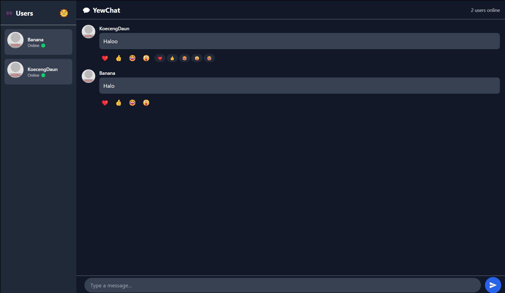

## Bukti

## Penambahan

Setelah memikirikan beberapa hal, ada beberapa yang benar benar ingin saya coba.
1. Dark mode : Kenapa saya ingin mencoba ini, karena saya memikir ini merupakah hal yang menurut saya membingungkan karena perlu mengubah warna dan template dan setelah mecoba saya mulai mengerti meskipun menurut saya terlalu manual tapi menyenangkan juga untuk dicoba 
2. Reaction : Saya mencoba membuat seperti discord Reaction dengan ide awal menambahkan emoticon pack namun penyimpanannya menurut saya melebihi batas saya tetapi mencoba sekedar reaction menurut saya sangat menyenangkan untuk dicoba
3. Banyak User + Status : meskipun tidak terlalu kreatif tapi menurut saya ini sangat unik karena biasanya chat-chat ada seperti ini dan saya ingin benar benar mencoba cara membuatnya